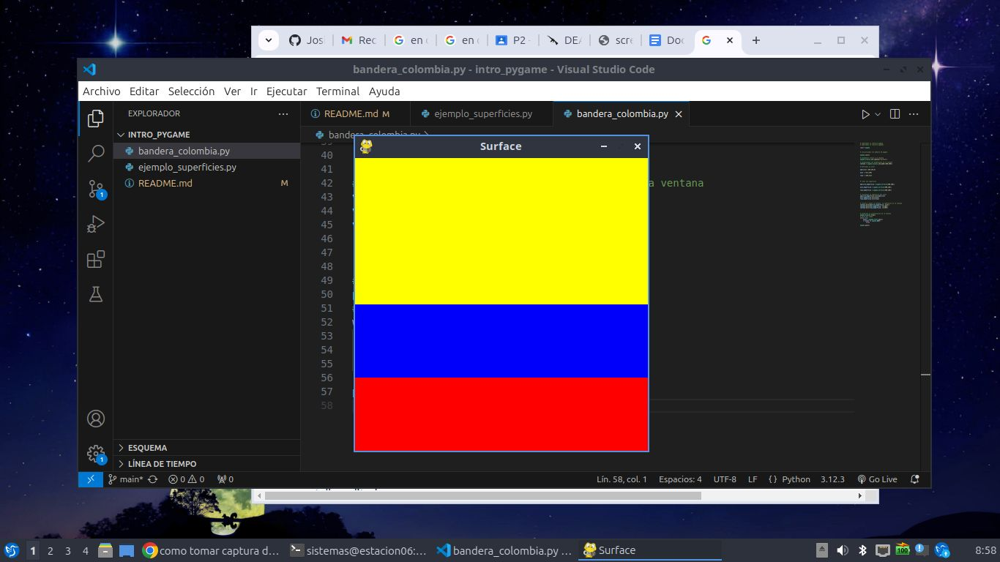

# intro_pygame
estructura de un juego en pygame

# inicialización

- Como en todo programa en python, se debe importar los módulos o librerias a utilizar.
`import pygame`

inicializar pygame usando la funcion init {}. Inicializa todos los módulos de pygame importados.
`pygame.Init`

## visualización de la ventana

`ventana = pygame.display.set_mode(600,400)`

- set_mode es la función encargada de definir el tamaño de la ventana. En el ejemplo se está definiendo una ventana de 600 de ancho por 400 de alto.

`pygame.display.set_caption("mi ventana")`

- set_caption() es la función que añade un título para la ventana.

### Función set_mode

`set_mode(size=(0,0), flags = 0, depth = 0, display = 0)`

- size = (600,400): define el tamaño de la ventana

-flags: define uno o mas comportamientos para la ventana
    -Valores_
    |-pygame.FULLSCREEN
     -pygame.RESIZABLE
-Ejemplos:
     -flags = pygame.FULLSCREEN | pygam.RESIZABLE: pantalla completa, dimensiones modificables.

##  bucle del juego - game loop

- bucle infinito que se interrumpirá al cumplir ciertos criterios:

-Relog interno del juego.
- En cada iteración del bucle del juego podemos mover a un personaje, o tener en cuenta que un objeto a alcanzado a otro, o que se a cruzado la linea de llegada, lo que quiere decir que la partida a terminado.
-Cada iteración es una oportunidad para actualizar todos los datos relacionados con el estado actual de la partida.
- En cada iteración se realizan las siguientes tareas:
    1. Comprobar que no se alcanzan las condiciones deparada, en cuyo caso se interrumpe el bucle.
    2. Actualizar los recursos necesarios para la iteración actual.
    3. Obtener las entradas del sistema, o de la interacción con el jugador.
    4. Actualizar todas las entidades que caracterizan el juego.
    5. Refrescar la pantalla

## Superficies pygame

- Superficie: 
     - elemento geométrico:
     - linea, polígono, imagen,
     - texto que se muestra en la pantalla
    - el polígono se puede o no rellenar de color
     - Las superficies se crean de diferente manera dependiendo del tipo:

    - imagen:image.load()
    - Texto: font.render()
    - superficie genérica: pygame.surface()
    - Ventana del juego: pygame.set_mode() 

# Bandera de Colombia 
     (Código)
```Python
# importamos la libreria pygame
# importamos la libreria pygame

import pygame


# inicializamos los modulos de pygame 

pygame.init()

# establecer titulo a la ventana 
pygame.display.set_caption("Surface")

# establecemos las dimensiones de la ventana 
ventana = pygame.display.set_mode((400,400))

# definimos un color 

amarillo= (255,255,0)

azul = (0,0,250)

rojo = (255,0,0)


# crear una superficie 

amarillo_Superficie = pygame.Surface((400,200))

azul_Superficie = pygame.Surface((400,100))

rojo_Superficie = pygame.Surface((400,100))


# rellenamos la superficie del color
amarillo_Superficie.fill(amarillo)
azul_Superficie.fill(azul)
rojo_Superficie.fill(rojo)


# inserto o muevo la ventana  la superficie en la ventana
ventana.blit(amarillo_Superficie, (0,0))
ventana.blit(azul_Superficie, (0,200))
ventana.blit(rojo_Superficie, (0,300))


# actualiza la visualizacion de la ventana 
pygame.display.flip()
# bucle del juego
while True: 
    event = pygame.event.wait()
    if event == pygame.QUIT: 
        break 

pygame.quit() 
```



## Gestión del tiempo y los eventos

### Módulo time
- Este móduo ofrece varias funciones que permiten mostrar la sesión actual (desde el init) o pausada la ejecución, por ejemplo:
- funciones
     - pygame.time.get_tics
     -pygame.time.waitpygame.time.delay

- objeto Clock
     - La función tic permite actualizar el reloj asociado con el juego actual.
     - se llama cada vez que se actualizala pantalla del juego.
     - permite especificar el número máximo de fotogramas que se muestran por segundo, y por tanto, limitar y controlar la velocidad de ejecución del juego.
     - si insertamos en un bucle de juego la siguiente linea, garantizamos que nunca se irá mas rapido de 50 fotogramas por segundo: `Clock.tick(50)`

### Gestión de eventos
- Hay diferentes formas para que el programa sepa que se a desencadenado un evento.
- es esencial que los programas puedan conocer inmediatanme las acciones del jugador a través del teclado, el mouse, un joystick o cualquier otro periférico.

##### Función  pygame.event.get
- permite obtener todos los eventos en espera de ser procesados y que están disponibles en una cola.
- si no hay ninguno, entonces se obtiene una colección vacía

```Python
# usamos un bucle for para recorrer todos los eventos de la colección al llamar a la función get.

for event in pygae.event.get():
     if event.type== pygame.KEYDOWN:
          if event.key==pygame.k_ESCAPE:
               PARAR JUEGO = True
```

#### Función pygame.event.wait
-  Esta función espera a que ocurra un evento, y en cuanto sucede está disponible.

```Python
while True:
     event=pygame.event.wait()
     if event.type == pygame.QUIT:
          break
```

#### Función pygame.event.poll
- Devuelve solo 

## Sonidos en Pygame
- pygame.mixer: módulo que permite la gestión del sonido.
- music: submódulo que gestiona la música de fondo. Necesariamente solo hay uno a la vez.
- Sound: objeto de mixer que se puede instanciar varias veces para usarlo en efectos de sonido del juego

### archivos de sonido 
-se recomienda usar dos formatos principalmente:
- formato WAV (waveform audio file format)
-formato abierto y gratuito DGG

### channel (canal) en pygame
- un juego tiene varios canales de sonido.
-se puede asignar un sonido al canal número 1 y  otro diferente al canal número 2.
-Entonces es posible reproducir sonidos simultaneamente activando la lectura en diferentes canales
## sprites
- objeto que asocia una ubicació, una representación gráfica (esta o aquela imagen, porejemplo) y un conjunto de propiedades.
- estas propiedades pueden ser un nombre, un texto, valores booleanos que caracterizan el objeto en cuestión (por ejemplo si el objeto se puede mover o no)
- una posible traducción del termino sprite podría ser "imagen/objeto" que se actualiza con cada iteración del bucle del juego.
-cuanto mas complejo es el juego, mas objetos gráficos tiene que gestionar y actualizar, lo que puede ser tedioso.
- pygame usa no solo la noción de sprite, sino la noción de grupo de sprites (group)
- la noción de group permite agrupar los objetos del mismo tipo. ejemplo: Todos los soldados de un ejercito, lo que se entiende como una solución de instancias de una clase Soldado.
- un determinado procesamiento se puede aplicar a un conjunto o subconjunto de sprites.  EJEMPLO: cambiar el color de todos los enemigos o hacerinvisibles algunos objetos.